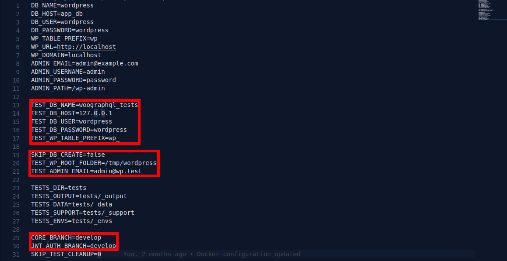
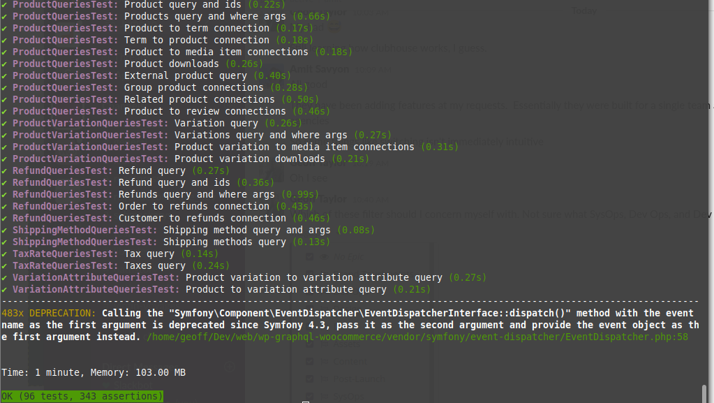
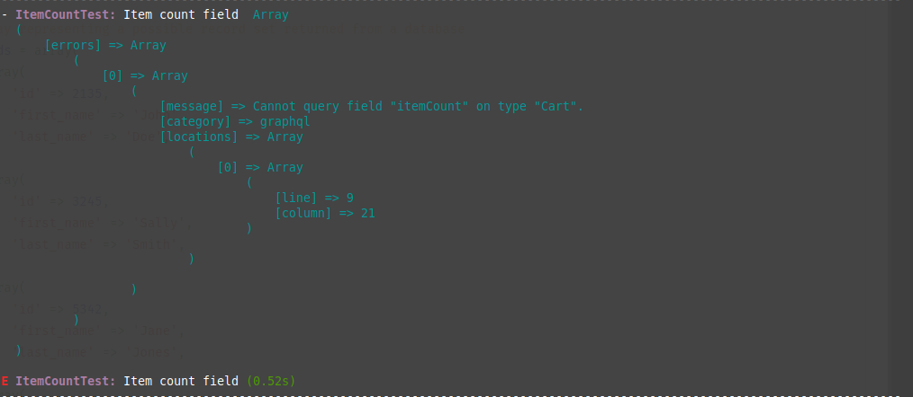

When extending the **WPGraphQL** API can be tricky at times, even more so when dealing with a massive plugin like WooCommerce.
Don't let this discourage you though, it's possible simplify the WPGraphQL development with the use of **Test-Driven Development (TDD)**. Now if you've ever been told anything about **TDD**, it's probably that **TDD** doesn't always fit everyone's development process. Nonetheless, the argument I'm trying to make is here is that using **TDD** and follow this guide, you'll learn how to make proper changes to the **WPGraphQL/WooGraphQL** schema as well as read code that you know works regardless of where the GraphQL request came from.

# Codeception & the wp-browser module
**WPGraphQL/WooGraphQL**'s use **[Codeception](https://codeception.com/)** and the **[wp-browser](https://wpbrowser.wptestkit.dev/)** Codeception module created by [Luca Tumedei](https://www.theaveragedev.com/) for running the automated test suite. We'll be using Codeception scaffolding to generate all the tedious test code, but this will not be an in-depth guide on either of these libraries. It's not required to process with this tutorial, but it's highly recommended that after finishing this tutorial you take a look at the documentation for both.
- **[Codeception](https://codeception.com/docs/01-Introduction)**
- **[wp-browser](https://wpbrowser.wptestkit.dev/)**

# Setting up WordPress for testing
Before we can begin testing we need a local WordPress installation. If you already have a local installation of WordPress for development, you can use that if you wish skip to **[Setting up Codeception](#settingupcodeception)**. If you don't have a local installation or simply don't want to use your local installation, you can use the **[WP-CLI](https://wp-cli.org/)** plugin test environment.

## Prerequisties
Have install **PHP**, **MySQL** or **PostgreSQL**, **Composer**, and **[WP-CLI](https://wp-cli.org/)** installed as well as terminal or shell access.

1. Start by cloning **[WooGraphQL](https://github.com/wp-graphql/wp-graphql-woocommerce)**.
2. Open your terminal.
3. Copy the `.env.dist` to `.env` by execute the following in your terminal in the **WooGraphQL** root directory.
```
cp .env.dist .env
```
4. Open the .env and update the highlighted environmental variables to match your machine setup.

5. Last thing to do is run the WordPress testing environment install script in the terminal.
```
composer install-wp-tests
```

This will create and configure a WordPress installation in a temporary directory for the purpose of testing.

# Setting up Codeception
Now that we have setup our testing environment, let's run the tests. To do this we will need to install the **Codeception** and the rest of our **devDependencies**
1. First run `composer install` in the terminal.
2. Next copy the `codeception.dist.yml` to `codeception.yml`
```
cp codeception.dist.yml codeception.yml
```
3. Open `codeception.yml` and make the following changes.


Now you all set to run the tests.

# Running the tests
Now we're ready to get started with testing. There is a small issue you may have with our testing environment. The WordPress installation we created doesn't support **end-to-end (*e2e*)** testing, however this won't be a problem. **WPGraphQL** is an API and most of the time you can get away with just ensuring that your query works, and **WPGraphQL** provides a few functions that will allow us to do just that.

Well, let's get started by running all the unit tests. Back in your terminal run the following:
```
vendor/bin/codecept run wpunit
```
If everything is how it should be you should get all passing tests.


# Writing your first WooGraphQL and WPGraphQL WPUnit test
This rest of this guide walk through creating a competent WPUnit test and implemented the functionality needed to ensure that test passed. For the most part everything used here can be used when making changes to WPGraphQL as well as many of the WPGraphQL extensions created by @jasonbahl, myself and the WPGraphQL community.

The functionality we'll be adding in the coming steps will be to add the **Integer** field `itemCount` on the **Cart** object type. To do this we'll be.

1. **Generating a WPUnit test file** Now typically for a feature so small it would be enough to update the first test in the **CartQueriesTest** class to include the desired `itemCount` field, however to the purpose of this guide we'll be creating a new test file named **ItemCountTest**.
2. **Writing our test** The name says it all.
3. **Run the test expecting failure** The purpose of this step will be used to introduce to **WPGraphQL**'s Error Reporting and the `codecept_debug` function.
4. **Implementing our changes** This step will do some exploring into how **WooGraphQL** and **WPGraphQL** work behind the scenes, and diving in to some key components. After acquiring a grasp of WPGraphQL execution implementing the desired changes with be trivially. 
5. **Run test expecting success** The final step will be to the **ItemCountTest** looking for success this time. 

## Generating a WPUnit test file
The PHP testing suite used by WPGraphQL and WooGraphQL is Codeception, but they don't manage the `codeception/codeception` in **Composer**. That is done by the `lucatume/wp-browser` package. This package, developed and maintained by *[theAverageDev](http://theaveragedev.com/)* [Luca Tumedei](https://github.com/lucatume), **[wp-browser](https://wpbrowser.wptestkit.dev/)** is a suite of Codeception modules that provide tools designed specifically for testing WordPress sites, themes, and plugins on multiple levels. The `lucatume/wp-browser` package functions as a one-stop shop managing Codeception and all it's dependencies for WPGraphQL and many of it's extensions.

So having done everything above, and finally being ready for development, begin by generating the **ItemCountTest** test file with Codeception `generate` command. Run the following in your terminal from the project root directory
```
vendor/bin/codecept generate:wpunit wpunit "ItemCount"
```
This will generate a new test file at `tests/wpunit/ItemCountTest.php`. The `generate` is an easy-to-use tool of convience. You learn more about [here](https://codeception.com/for/wordpress).

The `ItemCountTest.php` file should be a familiar site to anyone whose used Codeception or PHPUnit *(which Codeception is built on)*.

```
<?php

class ItemCountTest extends \Codeception\TestCase\WPTestCase
{

    public function setUp()
    {
        // before
        parent::setUp();

        // your set up methods here
    }

    public function tearDown()
    {
        // your tear down methods here

        // then
        parent::tearDown();
    }

    // tests
    public function testMe()
    {
    }
}
```

### setUp()/tearDown() and others
This functions execute before and after every function. The `setUp()` in particular is perfect place to create objects such posts, products, orders, etc to test with as well as set any WordPress options that maybe needed or interfere with the tests. The `tearDown()` is good for deleting things that Codeception and wp-browser miss, which isn't much so it not uncommon for the function to be left an empty stub.

There's also the `wpSetUpBeforeClass( $factory )` and `wpTearDownAfterClass( $factory )` that are run before all the tests, however their use-case is even move rare then `tearDown()` on account that these methods are static and don't have access to the same `$this` context as the `setUp()`, `tearDown()` or `test*()` function.

### test*() functions
Class functions that are prefix with `test` are tests. These functions are run on isolation for the most part. Test function must be `public` access. The purpose of the test function is to confirm the correct data is provided by when requested. This is done using the `Assert` library provided by PHPUnit and used by will everything on top of it.
```
$this->assertEquals( array( 5 ), [ 5 ] );
```

## Writing our test
Make changes to GraphQL API is always a rather top-down after, meaning you'll have an idea of how you want the query to look before you have an idea of how you want it's implementation to look. For example the query in relation to the changes we want to make could as follows.
```
cart {
    contents {
        nodes {
            quantity
        }
    }
    itemCount
}
```
In the next section we'll be taking this query and creating our test around it.


> If you didn't already know, an `itemCount` field already exist. It just happens to be under the `contents` connection as a field you can access it like this.
> ```
cart {
    contents {
        itemCount
    }
}
> ```

### WooGraphQL Codeception Helpers
WooCommerce is a vast WordPress plugin with a lot moving parts and getting them all to play nice can be a daunting task. To address this WooGraphQL's testing suite provides a number of helpers for create just the right scenario for needed for your tests. In this guide you'll be expose to the `cart` and `product` helpers, but there are quite a few. However documentation on them is pretty non-existant at the time of creation for this guide. Until this is rectified, it's recommended that you view helper [files](https://github.com/wp-graphql/wp-graphql-woocommerce/tree/develop/tests/_support/Helper/crud-helpers) to get a general idea of what they are and their capabilities.

### Our setUp()
Let's finish begin writing out test by creating our scenario with the `setUp()`. Our scenario for this is test is rather simple, our query just need some products and those products have to be in the cart. Using `product` and `cart` helpers we can do this in a few lines of code.
```
public function setUp()
{
    // before
    parent::setUp();

    $this->product  = $this->getModule('\Helper\Wpunit')->product();
    $this->cart     = $this->getModule('\Helper\Wpunit')->cart();
    $this->products = array(
        array( 'product_id' => $this->product->create_simple(), 'quantity' => 1 ),
        array( 'product_id' => $this->product->create_simple(), 'quantity' => 1 ),
        array( 'product_id' => $this->product->create_simple(), 'quantity' => 2 ),
        array( 'product_id' => $this->product->create_simple(), 'quantity' => 3 ),
    );
    $this->cart->add(...$this->products);
}
```
And that's it, scenario created. You maybe confused, but we'll break it down.
```
$this->product = $this->getModule('\Helper\Wpunit')->product();
$this->cart    = $this->getModule('\Helper\Wpunit')->cart();
```
This just assigned the `product` and `cart` helpers to simple reusable class member for later use in the coming test and the rest of the `setUp()`.
```
$this->products      = array(
    array( 'product_id' => $this->product->create_simple(), 'quantity' => 1 ),
    array( 'product_id' => $this->product->create_simple(), 'quantity' => 1 ),
    array( 'product_id' => $this->product->create_simple(), 'quantity' => 2 ),
    array( 'product_id' => $this->product->create_simple(), 'quantity' => 3 ),
);
```
The `$product` array holds the `product_id`s and `quantity`s of products being add to our cart. `create_simple( $args = array() )` creates a new product with a random name and price and return the `product_id` of the product. There are `create_external( $args = array() )`, `create_grouped( $args = array() )` and `create_variable( $args = array() )`, as well as many more create functions for creating other objects related to products.
```
$this->cart->add(...$this->products);
```
And finally, you have probably figured out that this adds the products in `$products` to the cart. `cart` helper functions as a glorified wrapper for the `WC()->cart` instance with a extra features for testing.

Now that our scenario is set. Let's get to are test. We'll start by change the name of the test to `testItemCountField` and assign our query to a string variable
```
public function testItemCountField()
{
    $query = '
        query {
            cart {
                contents {
                    nodes {
                        quantity
                    }
                }
                itemCount
            }
        }
    ';
}
```
Simple enough, next we'll run our query through WPGraphQL using `graphql( $request_data = [] )`. 
```
public function testItemCountField()
{
    ...

    $actual = graphql( array( 'query' => $query ) );

    // use --debug flag to view.
    codecept_debug( $actual );
}
```
`graphql()` is a function provided by WPGraphQL. It will process a GraphQL request and return the results as an associative array. This makes it a great tool for testing our queries.

```
// use --debug flag to view.
codecept_debug( $actual );
```
If you've taken a look at any of the other tests in WooGraphQL you may have noticed this snippet of code every always every `graphql()` call. `codecept_debug( $data )` is a debug function that dumps the value of `$data` to console. This dump information can viewed by using the `--debug` flag when using Codeception's `run` command. Its use here is great because when we run our test later in debug mode we'll know exactly what WPGraphQL is returning for our query.

The last step in our test is to confirm the we received the correct values for our `itemCount` field.
```
public function testItemCountField()
{
    ...

    $expected = array_sum( array_column( $this->products, 'quantity' ) );
    $this->assertEquals( $expected, $actual['data']['cart']['itemCount'] );
}
```
And that's our test.

```
<?php

class ItemCountTest extends \Codeception\TestCase\WPTestCase
{

    public function setUp()
    {
        // before
        parent::setUp();

        $this->product  = $this->getModule('\Helper\Wpunit')->product();
        $this->cart     = $this->getModule('\Helper\Wpunit')->cart();
        $this->products = array(
            array( 'product_id' => $this->product->create_simple(), 'quantity' => 1 ),
            array( 'product_id' => $this->product->create_simple(), 'quantity' => 1 ),
            array( 'product_id' => $this->product->create_simple(), 'quantity' => 2 ),
            array( 'product_id' => $this->product->create_simple(), 'quantity' => 3 ),
        );
        $this->cart->add(...$this->products);
    }

    public function tearDown()
    {
        // your tear down methods here

        // then
        parent::tearDown();
    }

    // tests
    public function testItemCountField()
    {
        $query = '
            query {
                cart {
                    contents {
                        nodes {
                            quantity
                        }
                    }
                    itemCount
                }
            }
        ';

        $actual = graphql( array( 'query' => $query ) );

        // use --debug flag to view.
        codecept_debug( $actual );

        $expected = array_sum( array_column( $this->products, 'quantity' ) );
        $this->assertEquals( $expected, $actual['data']['cart']['itemCount'] );
    }
}
```

## Run the test expecting failure
Now that the test is created, we will run it expecting failure and using the `--debug` flag.
```
vendor/bin/codecept run wpunit ItemCountTest --debug
```
Run this statement in the terminal will make Codeception run just the `ItemCountTest` in debug mode. This way we can see exactly WPGraphQL returns for our query.


Running the test will result in the error above. **Cannot query field "itemCount" on type "Cart".** The error is quite easy to understand. We cannot query a field that doesn't yet exist.

## Implementing our changes

## Run test expecting success

# Going Forward
## Writing your first test

